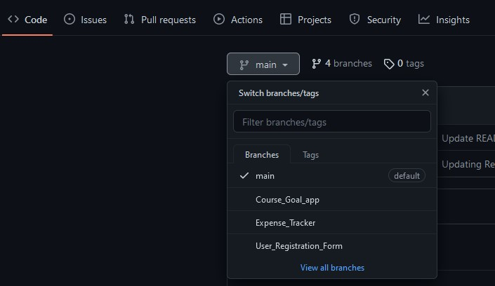

# ReactJs-Projects
This is a repository of all the projects I built by following the "React - The Complete Guide (incl Hooks, React Router, Redux)" course on Udemy. 

## How to use

The code snapshots are organized in multiple **branches** where every branch **represents a course section**.

For example, the branch [Expense_Tracker](https://github.com/Harith-Laxman/ReactJs-Projects/tree/Expense_Tracker) holds all code for the app Expense Tracker built during the first few sections of the course.

You can switch branches via the branch dropdown above the directory explorer.

### Downloading code snapshots

You can download all the content of a branch via the "Code" button here on Github. You can then either [clone](https://docs.github.com/en/github/creating-cloning-and-archiving-repositories/cloning-a-repository) the repository or simply download the selected branch content as a ZIP file.

**Important:** You always download the **entire branch content!**

You can then dive into the interesting folders (e.g. the individual code snapshots) locally on your hard drive.

### Running the attached code

You can use the attached code simply to compare it to yours. But you can also run it.

To run my code, navigate into a specific code snapshot folder via the `cd` command in your command prompt or terminal first.

Then run `npm install` to install all required dependencies (this will create a `/node_modules` folder).

**Important:** If you're using the code for a module that requires API keys or a backend (e.g. the module about sending Http requests), you'll have to use **your backend URLs** or API keys. Mine won't work (I disabled my projects).
